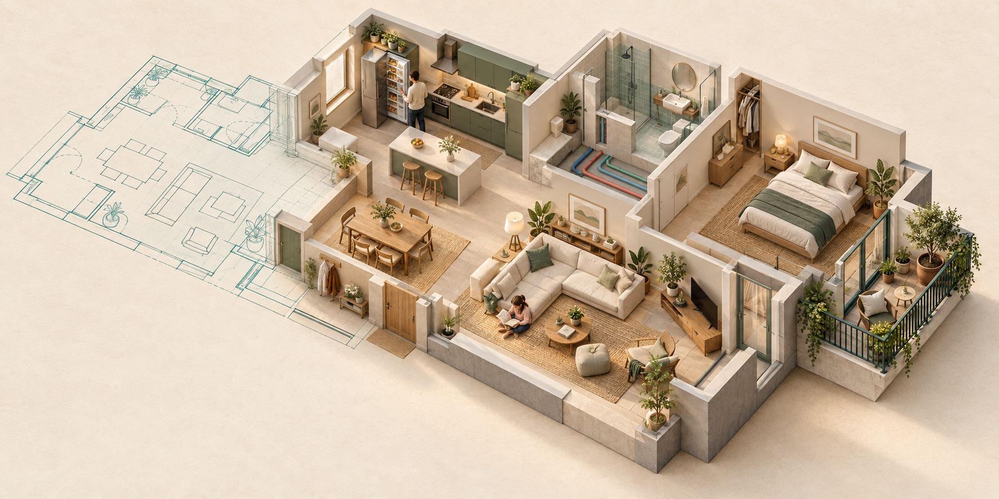
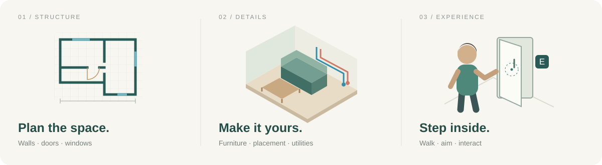
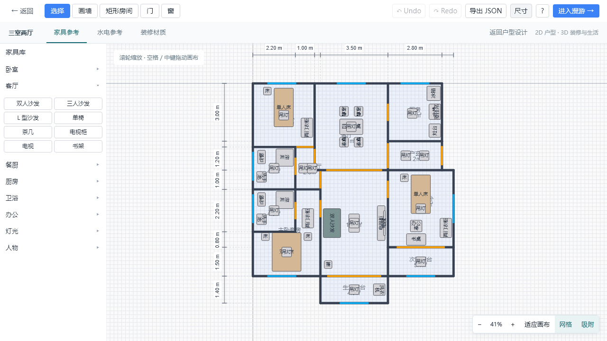
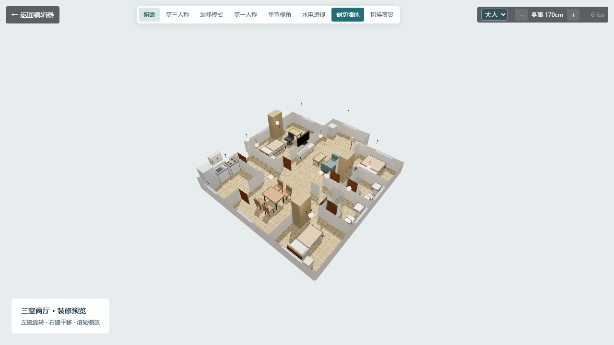
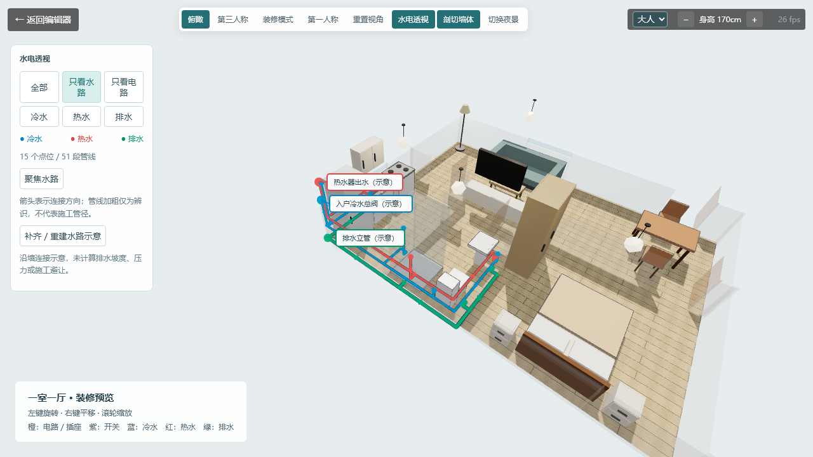

# RoomSim

浏览器内的装修与生活体验模拟器：2D 画户型 → 3D 精确装修、规划水电 → 操作一个人在家中体验生活。



*先设计空间，再走进生活。封面为 AI 生成的概念插画，非软件截图；当前实际画面见下方。*

**在线体验：** [https://1120040377.github.io/RoomSim-TDD/](https://1120040377.github.io/RoomSim-TDD/)  
**English docs:** [README.md](./README.md)

技术设计详见 [RoomSim-TDD.md](./RoomSim-TDD.md)。

### 从户型，到家



| 01 · 在平面中推敲布局 | 02 · 在立体中检查空间 |
| :--- | :--- |
| [](./docs/images/floor-plan.png) | [](./docs/images/apartment-3d.png) |
| 墙、门窗与房间结构；可展开家具参考。 | 剖切查看客餐厅、卧室、厨卫与阳台关系。 |

*以上为项目实际运行截图，点击可查看原图。*

---

### 这个工具适合你吗？

**刚拿到新房钥匙，家具还没买。**  
对着空荡荡的毛坯间，手里捏着沙发、床、衣柜的尺寸单，不确定塞进去之后人还能不能正常走路。在 RoomSim 里把户型画出来、家具摆一遍，提前在里面"走"一圈，再下单。

**厨房动线：冰箱→备菜→炒菜→刷碗。**  
三角动线顺不顺手？两个人同时下厨会不会撞到？在 RoomSim 里模拟完整路径，确认没有多余折返，再定橱柜方案。

**半夜起来上厕所，摸黑走那段路。**  
从床边到卫生间门口，会不会绕一圈、撞到床角或衣柜？第一人称视角直接走一遍夜路，看看动线是否顺畅。

**书房办公，中途去卫生间或厨房倒水。**  
两居室书房在最里面，每次起身要经过几道门、走廊够不够宽？提前用 RoomSim 验证，避免装修完才发现每次都要侧身通过。

---

### 快速开始

```bash
pnpm install
pnpm dev          # http://localhost:5174/
pnpm test         # Vitest 全量单测（当前 157 tests）
pnpm typecheck    # vue-tsc
pnpm build        # 生产打包到 dist/
pnpm preview      # 预览 dist
```

> **Windows 环境提示**：如果看到 `Cannot find module @rollup/rollup-win32-x64-msvc` 或 `Application Control policy has blocked` 等错误，本项目已通过 `package.json` 的 `pnpm.overrides` 把 rollup 替换为 `@rollup/wasm-node`（纯 JS）绕开。重新 `pnpm install` 即可。
>
> 若 `vue-tsc` 报 `Search string not found: "/supportedTSExtensions = .*(?=;)/"`，说明 vue-tsc 版本与 TypeScript 不匹配，保持 `vue-tsc ^2.0.0` 与 `typescript ^5.3.0` 组合。

### 水电规划与装修预览



*把隐藏的管线看清楚：只看水路 → 聚焦水路。实际运行截图；管线为规划示意，不是施工图。*

**水路连接与清晰显示**：新建模板包含入户冷水总阀、热水器冷水入口 / 热水出口、排水立管及沿墙连接的主干 / 分支 / 设备立管。冷水、热水、排水分别用蓝、红、绿表示，主干示意高度为 20 / 34 / 5 cm，使用不同平面偏移和墙面接口错位避免重叠。显示采用加粗描边、方向箭头和源头标签，粗细仅用于辨识，不代表施工管径。

查看方法：Esc 释放鼠标 → 打开「水电透视」→「只看水路」→「聚焦水路」，也可单独显示冷水、热水、排水或电路。旧方案使用「补齐 / 重建水路示意」，保留既有点位、手绘管线和电路，只替换本功能生成的连接，支持撤销及自动保存；旧支路可能与新连接并存。墙体断开时会报告未连通接口，不强行跨越断开的墙网。源头位置和连接路径都是规划示意，未考虑水压、排水坡度、防水套管及结构避让，不作为施工图。

**住宅模板更新**：两室两厅、三室两厅已重做为玄关 → 连通客餐厅 → 短过厅 → 卧室的住宅布局，加入生活阳台；三室两厅含主卧套卫及双阳台。公共厅之间使用无门扇通道，不再摆放巨型平开门。卡片面积按实际建模多边形计算（含建模阳台），不是楼盘销售建筑面积。更新仅影响新建模板，历史保存方案不自动覆盖。

设计参考：[金茂·满曜 115㎡三室两厅户型图](https://m.fang.com/xf/bj/1010203341/134605.htm)、[金地西湖春晓住宅设计案例](https://award.kinpan.com/detail/index/1698855570263231473906)。参考其玄关、集中交通、主卧套卫、客餐组织和阳台关系，项目中的模板为重新绘制的简化示意，不是上述楼盘的实测复刻或施工图。

**游玩鼠标**：第一 / 第三人称进入时尝试锁定并隐藏鼠标，使用相对位移持续转向，不受屏幕边缘限制。Esc 释放鼠标并停止人物输入，显示「继续游玩」；点击恢复。浏览器若限制自动锁定，需要点击一次「继续游玩」。装修 / 俯瞰保持普通鼠标操作。

第三人称人物已更换为圆润的关节模型，右上角可选择「大人 / 小孩」。默认身高分别为 170 / 120 cm；两者有独立头身比和四肢比例，支持行走、坐下与躺下。人物类型与身高切换为本次体验设置。

镜头支持水平 360° 环绕及大范围俯仰，拖动画面旋转、滚轮调整远近。屏幕中心显示准星，准星命中可用家具时变绿并显示 E 操作；只接受实际命中的近距离物体，隔墙、被其他家具遮挡或没有对准时不会触发。按 E 时重新检查射线，已取消 Q 切换目标和附近列表点击操作。

第三人称采用近距离肩后构图：成人默认约 1.15 米、儿童约 0.9 米，视点接近眼睛高度，人物位于左侧约 32%，默认以头肩和上半身为主，不再强制全身入镜；可滚轮拉远。准星平时为小圆点，命中后显示细圆环、家具名称和 E 动作，目标家具轻微提亮；离开目标、切换模式或编辑重建时恢复原材质。交互距离仍从人物判断，镜头拉近不会增加触及范围。

第一人称使用相同的家具交互：点击画面锁定鼠标，对准冰箱、柜门、抽屉、座椅、床、灯、电视或用水设施后按 E；坐下与躺下调整视点高度，移动或点击起身恢复站立。Esc 仅释放鼠标，返回编辑器使用左上角按钮。第一 / 第三人称切换保留当前行走位置。

鼠标灵敏度已降低：第一人称为原来的 50%，第三人称环绕为原来的 45%，滚轮缩放为 65%。两种视角的准星均位于画面高度 44% 处（中央略上方），显示位置和拾取射线共用同一配置，避免瞄准错位。

2D 默认专注墙、门窗和房间结构；「展开平面参考」可辅助查看家具、水电。进入 3D 后选择「装修模式」，使用装修工作台；第三人称则进入人物生活模式。

- **3D 装修工作台**：家具添加、选择、三轴拖动、数值坐标、旋转、尺寸、底部离地高度、复制与删除；支持 1 / 5 / 10 / 20 cm 吸附步长。贴墙安装工具点击墙面定位并调整朝向。编辑可撤销、重做并自动保存。
- **立体水电**：在墙面或地面放置插座、开关；连续点击生成水平与竖向正交管线，显示实时预览，Enter 提交、Esc 取消。选中后可三轴移动，点位具有独立高度。
- **生活体验**：走近并用中心准星对准家具，按 E 操作；冰箱、衣柜、吊柜等开门，床头柜 / 电视柜抽屉抽拉，沙发和椅子坐下、床上躺下、起身。开合部分参与运行时碰撞；支持灯、电视、灶台及用水开关反馈。桌子等静态物品提供尺寸查看，不是所有家具都有专属动作。

- **2D 交互**：空格 / 中键 / 右键拖动画布，滚轮或按钮缩放，一键适应画布；网格与吸附可独立开关。画墙按 Shift 约束水平 / 垂直，矩形房间显示实时长宽和面积。切换工具 / Esc 会取消未完成预览。
- **水电点位**：插座、开关、接线盒、冷热水及排水点；点击放置，选择后拖动，编辑名称、离地高度、面板朝向和回路 / 用途。
- **管线**：电路、冷水、热水、排水四类等高直角管线。连续点击添加折点，Shift 改变转弯顺序，Enter 提交整条管线，Esc 取消。点位清单与管线长度自动统计，支持删除、撤销 / 重做。
- **装修**：全屋木地板 / 瓷砖 / 水泥地面，地面和墙面颜色，三组搭配预设。纹理在本地生成，无需下载材质。
- **3D**：默认第三人称跟随，镜头在人物斜上方，完整显示人物；WASD / 方向键移动、Shift 加速，拖动旋转、滚轮调节距离。支持走路动画、身高调节、碰撞和遮挡物淡出。可切换俯瞰（左键旋转、右键平移）或第一人称；提供重置视角、墙体剖切、水电透视和日夜切换。地板的 2D→3D 镜像问题已修复。

水电与材质保存于可选的 `plan.renovation` 字段，旧方案兼容；家具增加可选的离地高度和安装类型。新增字段参与 IndexedDB 自动保存及 JSON 导入导出。规划点位采用绝对坐标，移动墙体不会自动移动点位。管线长度包含已建模竖向段，不含坡度、接头或施工余量。预置方案提供按房间配置的家具、插座、开关和水电连接示意，尚未完成总配电网络及水电规范校验，不能作为施工图。当前材质应用于全屋，尚未提供逐房间铺装与吊顶建模。家具开合、人物姿态与设备开关属于临时体验状态，不保存；用水、烹饪、电视是简化视觉反馈，尚无生活需求值、物品库存或完整行为动画。

回归验证：`pnpm test`（157 项）· `pnpm e2e`（9 条）· `pnpm build`。覆盖模板拓扑与家具墙体碰撞、水路连通及重建保留手绘数据、立体管线、储物开合、人物交互，以及 3D 编辑 → 撤销恢复 → 刷新保存的完整路径。

### 原有功能

**编辑器（2D 俯视）**
- 画墙、矩形一键房间、门/窗吸附到墙放置
- 家具库 30 种 + 拖拽放置 + 属性面板（尺寸/颜色/旋转/复制/删除）
- 房间自动识别（平面图面遍历算法）
- 端点 / 墙中点 / 墙垂足 / 网格 四级吸附
- 撤销/重做（50 步，连续拖动自动合并）
- 人体工学警告 8 条规则（过道/沙发/床周/厨房三角/门开启区域/墙高…）
- 自动保存 IndexedDB（5s debounce）+ JSON 导入导出

**3D 漫游**
- 第一人称 WASD + 鼠标（PointerLock），Shift 跑步
- 墙体带开洞（门/窗几何切段）+ 地板 + 家具 Box + 轮廓
- 圆-OBB 碰撞（防穿墙，sweep 细分避免隧穿）
- E 键交互：开关门 90° 动画、开关灯（PointLight intensity）
- 身高 140–200cm 实时调节
- 屏幕中心射线检测 + HUD 提示

**模板**：仅保留空白、单间公寓、一室一厅、两室一厅、两室两厅、三室两厅。历史已保存方案不受模板列表调整影响。

### 快捷键

编辑器：`V` 选择 · `W` 画墙 · `R` 矩形房间 · `D` 门 · `I` 窗 · `Esc` 取消 · `Ctrl+Z/Y` 撤销重做 · `Ctrl+D` 复制 · `Del` 删除 · `?` 快捷键帮助

漫游：`WASD` 移动 · `Shift` 跑步 · `E` 交互 · `Esc` 退出

### 架构

```
Vue 3.4 + TypeScript 5 + Vite 5
├── 2D 渲染：Konva.js 9（6 层 Stage/Layer 架构）
├── 3D 渲染：Three.js 0.160（原生 API，未经 TresJS）
├── 状态：Pinia 2 + shallowRef + 命令模式（20+ 命令，do/undo 完全可撤销）
├── 存储：Dexie 4（IndexedDB）+ Zod schema 校验
└── 样式：UnoCSS
```

**分层原则**：`geometry/` 全是纯函数（无 Vue / 无 Konva / 无 Three.js 依赖），100% 测试覆盖；`store` 持有状态，UI 只读+派发命令；`editor` 和 `walkthrough` 都订阅同一份 Plan。

**2D↔3D 坐标约定**（锁死在 [walkthrough/coord.ts](src/modules/walkthrough/coord.ts) 并有测试保护）：
```
editor (x, y)  ⇒  three (x, heightZ_cm, y) × 0.01   // cm → m
editor angle   ⇒  three.rotation.y = -angle
```

### 测试

```bash
pnpm test              # Vitest 单测（当前 157 pass）
pnpm test -- <pattern> # 筛选
pnpm test:watch        # 监视模式
pnpm e2e:install       # 首次跑 e2e 前下载 Chromium (~111MB)
pnpm e2e               # Playwright 6 条核心路径
```

**单测覆盖**（`tests/unit/`）：
- `geometry/`：opening-cut / collision（slide）/ room-detect / snap / nearest-wall
- `commands/`：do ↔ undo 深度等价，连续 Move/Rotate 合并
- `store/history`：栈管理 + 合并 + 容量限制 + BatchCommand
- `walkthrough/`：coord 换算约束 + WallBuilder slab 数 + CollisionBuilder
- `ergonomics/`：8 条规则各自的正/反例 fixture
- `templates/`：模板都通过 PlanSchema
- `model/schema`：Zod 校验
- `storage/migrations`：版本迁移骨架

**E2E 覆盖**（`tests/e2e/smoke.spec.ts`）：
1. 模板 → 编辑器 → 返回列表 → 刷新后方案还在
2. 模板 → 进入漫游 → canvas 渲染 + 身高调节可见
3. 导入损坏 JSON → 错误提示 → 原方案不变

### 目录结构

```
src/
├── views/                  # 三个页面（Home / Editor / Walkthrough）
├── components/             # Toolbar / FurniturePanel / PropertyPanel / HelpOverlay
├── modules/
│   ├── model/              # types + Zod schema + defaults
│   ├── store/              # Pinia（plan / editor / history）
│   ├── commands/           # 14 个命令，按 wall/opening/furniture 分包
│   ├── geometry/           # 纯几何算法
│   ├── editor/             # Konva Canvas + 工具策略模式
│   ├── walkthrough/        # Three.js builders + FPS 控制器 + 碰撞
│   ├── ergonomics/         # 规则引擎 + 8 条规则
│   ├── storage/            # Dexie + 导入导出 + 迁移
│   └── templates/          # 家具 catalog + 户型模板
└── styles/
tests/unit/                 # 按模块镜像
```

### 部署

纯静态，任何支持托管的平台都行。路由用 `createWebHashHistory`（URL 里有 `#`），所以不需要 SPA rewrite，子目录部署也无需配 fallback。

#### GitHub Pages（推荐 · 已配 CI）

仓库里 [.github/workflows/deploy.yml](.github/workflows/deploy.yml) 是开箱即用的工作流：push 到 `main` 触发 → typecheck + 单测 + build + 发布。

**启用**：push 到 `main` 即可。workflow 里 `actions/configure-pages` 用了 `enablement: true`，会在仓库未开启 Pages 时自动启用并把 Source 设为 GitHub Actions，不必手动到 Settings 配置。

第一次跑完后访问 `https://<user>.github.io/<repo>/`。

构建会通过环境变量 `BASE_URL=/<repo>/` 注入到 Vite，资源引用自动加前缀。本地 `pnpm dev` / `pnpm build` 不受影响（默认 `/`）。

#### Vercel
```bash
pnpm build
# 把 dist/ 上传，或连 git 自动部署。base 默认 / 即可。
```

#### 任意静态托管 / OSS
```bash
pnpm build
# 上传 dist/，把 index.html 作为默认首页
# 子目录部署时：BASE_URL=/sub/ pnpm build
```

### 已知限制（P1+）

- **墙拆分**：新预置方案已切分共享墙端点并验证房间识别；手绘内墙端点落在既有墙中段时，仍需要自动拆墙能力。
- **MobileFPS**：移动端摇杆/滑屏转视角还没做，移动端只能用编辑器。
- **电视**：支持生活模式开关屏幕发光，未实现 VideoTexture 视频播放。
- **选中墙/门窗**：PropertyPanel 目前只对家具生效。
- **InstancedMesh**：家具数超过 100 时可合批优化。

### License

个人装修工具项目。未声明 License。
